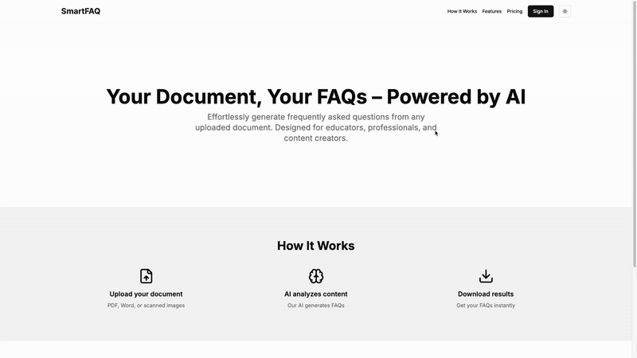

# SmartFAQ



An AI-powered application to automatically generate FAQs from PDFs, docs, and text.

## Prerequisites

- Python 3.10 or higher
- PostgreSQL 13 or higher
- Node.js 18 or higher
- Ollama (for AI model)

## Project Setup

### Installing Ollama (Required)

1. **Install Ollama:**
   ```bash
   curl -fsSL https://ollama.com/install.sh | sh
   ```

2. **Pull the Gemma model:**
   ```bash
   ollama pull gemma
   ```

   Note: You can change the model in `backend/core/settings/secret.py`:
   ```python
   OLLAMA_MODEL = "gemma"  # or "llama2", "mistral", etc.
   ```

### Backend Setup

1. **Clone the repository:**
    ```bash
    git clone https://github.com/mohmmde1/SmartFAQ.git
    cd SmartFAQ/backend
    ```

2. **Set up Python environment:**

    Using Poetry (recommended):
    ```bash
    # Install Poetry if not installed
    curl -sSL https://install.python-poetry.org | python3 -

    # Install dependencies
    poetry install
    ```

    OR using pip:
    ```bash
    # Create and activate virtual environment
    python3 -m venv venv
    source venv/bin/activate  # On Windows: venv\Scripts\activate

    # Install dependencies
    pip install -r requirements.txt
    ```

3. **Set up PostgreSQL:**
    ```bash
    # Create database
    createdb smart_faq

    # Or using psql
    psql
    CREATE DATABASE smart_faq;
    \q
    ```

4. **Configure environment:**
    ```bash
    # Copy settings template
    cp core/settings/secret_template.py core/settings/secret.py

    # Update secret.py with your database settings:
    DATABASES = {
        "default": {
            "ENGINE": "django.db.backends.postgresql",
            "NAME": "smart_faq",
            "USER": "your_db_user",
            "PASSWORD": "your_db_password",
            "HOST": "localhost",
            "PORT": "5432",
        }
    }
    ```

5. **Initialize database:**
    ```bash
    # Create initial migrations
    python manage.py makemigrations

    # Apply migrations
    python manage.py migrate
    ```

6. **Run development server:**
    ```bash
    python manage.py runserver
    ```

### Frontend Setup

1. **Navigate to frontend:**
    ```bash
    cd ../frontend
    ```

2. **Install dependencies:**
    ```bash
    npm install
    ```

3. **Configure environment:**
    ```bash
    # Copy environment template
    cp .env.template .env

    # Generate secrets
    echo "NEXTAUTH_SECRET=$(openssl rand -base64 32)"
    echo "JWT_SECRET=$(openssl rand -base64 32)"
    ```

4. **Start development server:**
    ```bash
    npm run dev
    ```

### Google OAuth Setup

1. **Configure Google Cloud Console:**
    - Visit [Google Cloud Console](https://console.cloud.google.com/)
    - Create a new project or select existing
    - Enable the Google+ API
    - Configure OAuth consent screen:
        - Add authorized domains
        - Add scopes for email and profile
    - Create OAuth 2.0 credentials
        - Add authorized redirect URIs:
            - `http://localhost:3000/api/auth/callback/google` (development)
            - `https://your-domain.com/api/auth/callback/google` (production)

2. **Update configuration files:**

    In `backend/core/settings/secret.py`:
    ```python
    GOOGLE_CLIENT_ID = "your-client-id"
    GOOGLE_CLIENT_SECRET = "your-client-secret"
    OAUTH_CALLBACK_URL = "http://localhost:3000"  # Change in production
    ```

    In `frontend/.env`:
    ```env
    GOOGLE_CLIENT_ID=your-client-id
    GOOGLE_CLIENT_SECRET=your-client-secret
    ```

### Configuration Options

Key settings in `secret.py`:
```python
# Debug mode (disable in production)
DEBUG = True

# Allowed hosts
ALLOWED_HOSTS = ["localhost", "127.0.0.1"]

# AI Model
OLLAMA_MODEL = "gemma"  # Available: "gemma", "llama2", "mistral"

# JWT Settings
SIMPLE_JWT = {
    "ACCESS_TOKEN_LIFETIME": timedelta(minutes=5),
    "REFRESH_TOKEN_LIFETIME": timedelta(days=1),
}
```

### Running Tests

```bash
# Using Poetry
poetry run pytest

# Using pip
pytest
```

### Security Notes

- Never commit `secret.py` or `.env` to version control
- Use strong, unique passwords for database
- In production:
  - Set `DEBUG = False`
  - Use proper SSL/TLS certificates
  - Set secure `ALLOWED_HOSTS`
  - Use environment variables for secrets

### Troubleshooting

- **Database Connection Issues:**
  - Verify PostgreSQL is running: `pg_isready`
  - Check database exists: `psql -l`
  - Ensure correct permissions: `psql -c "ALTER USER your_user WITH PASSWORD 'your_password'"`

- **Ollama Issues:**
  - Check Ollama service: `ollama serve`
  - Verify model: `ollama list`
  - Pull model again if needed: `ollama pull gemma`
